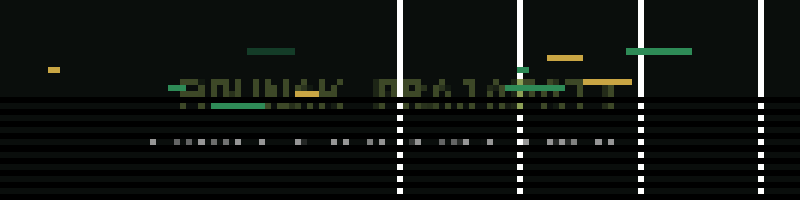

### full-stack dev · llm / rag engineering · computer vision

---

### ⟡ about

- 🎓 **B.Tech CSE** @ IIITDM Jabalpur (Batch 2024–2028) · CPI **8.5** (till Sem IV)
- 🔭 Building on full-stack + deep learning foundations, currently deep in **RAG and LLM engineering**
- 🤝 Open to internships, open-source contributions, and collaborations
- 🎾 Lawn tennis club member · also into music and drawing

---

### ⟡ tech stack

**Languages**

**Web & Databases**

**LLM / GenAI Engineering**

*RAG · QLoRA Fine-Tuning · Prompt Engineering · Vector Embeddings*

**ML / Deep Learning**

*timm · torchvision · Vision Transformers (ViT) · Mixed Precision (FP16/AMP) · Transfer Learning*

**Tools**

---

### ⟡ featured projects

<b>🔍 Creatine RAG Assistant — grounded, citation-verified research assistant</b>

 

Multi-layer RAG pipeline over 423 curated PubMed Central articles with hallucination-checking and confidence-based abstention.

- ChromaDB vector store with S-PubMedBert embeddings for topic-routed retrieval and paper ranking
- Extracts numeric facts (dosages, sample sizes, percentages) and verifies each appears verbatim in its source chunk
- Cross-checks every generated citation against retrieved chunks to flag possible hallucinations
- Pre-LLM relevance threshold — the system explicitly abstains under low retrieval confidence instead of guessing
- FastAPI backend + React frontend with a retrieval-trace panel

`Python` `FastAPI` `ChromaDB` `SentenceTransformers` `Groq LLM` `React`

<b>🐍 SerpentAI — Indian Snake Species Classifier</b>

 

Fine-tuned **DINOv2 ViT-L/14** on 13K+ SnakeCLEF 2022 images to build a 49-class classifier — **94.8% validation accuracy (98.4% top-5)**.

- 49 classes: 48 Indian snake species + a self-curated "no-snake" distractor class
- Two-phase, 30-epoch training: backbone frozen for 7 epochs (head warm-up) → fully unfrozen with cosine-annealed LR
- Mixed precision (FP16/AMP) training with gradient clipping, checkpoint-based resume support
- Multi-GPU (2×) training via DataParallel

`Python` `PyTorch` `timm` `DINOv2` `scikit-learn` `FP16/AMP` `Kaggle`

<b>⚡ ProdHack — AI-powered productivity tool</b>

 

Gamifies study sessions with AI-generated quiz challenges powered by **Gemini API** · Runner-up, "Can You Hack It" hackathon (Productive Track).

- User signup/login, profile dashboard, real-time 1v1 productivity battle rooms
- PDF upload and AI quiz generation
- Store items, wallet, theme equip flow, and playlist slots
- Leaderboard based on player progress
- CORS-ready deployment config for Vercel + Render

`React` `Express.js` `MongoDB` `Gemini API`

<b>🌍 WanderWise — travel planning web app</b>

 

Full-stack travel planner with 100+ destination records and full CRUD operations.

- RESTful API backend with modular Express.js routing and middleware
- Responsive React frontend optimized for mobile and desktop
- Clean, scalable architecture built for extensibility

`React` `Express.js` `Node.js` `MySQL` `REST APIs`

---

### ⟡ achievements

- 🥈 Runner-up, Productive Track — *"Can You Hack It"* (intra-college 24-hour hackathon), for ProdHack
- 🎯 Semifinalist, Flipkart Grid 8.0
- 📜 AI Engineer Core Track: LLM Engineering, RAG, QLoRA & Agents — Ligency/Ed Donner (Udemy)
- 📜 Programming with JavaScript — Meta (Coursera)
- 📜 HTML & CSS in Depth — Meta (Coursera)

---

### ⟡ github stats

---

  <i>Open to internship opportunities in Full-Stack Development, ML, and LLM/RAG Engineering.</i> 
  <b>Let's build something meaningful together.</b>

